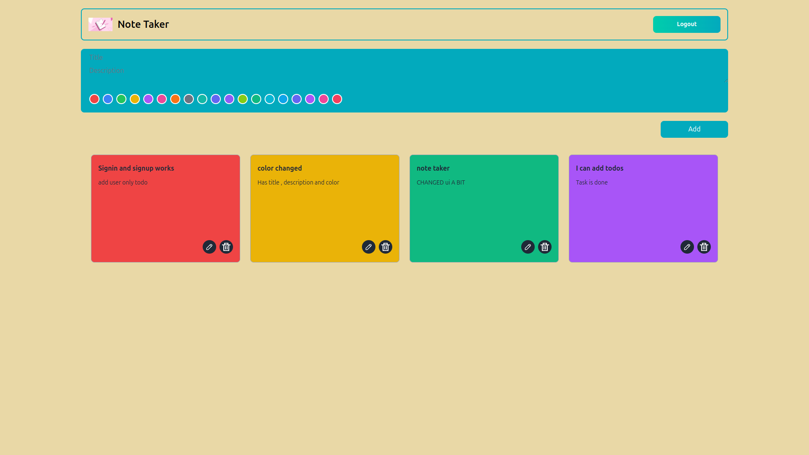

<!-- write a readme file for the project -->
# Project Name :  Note Taker 

## Description : A simple note taking app that allows you to create, read, update, and delete notes.

## Technologies Used: 
- Node.js
- Express.js
- Appwrite
- React
- Tailwind CSS

## Screenshots:

Contact me at : bddhanush03@gmail.com 

Thank you for reading this readme file.
